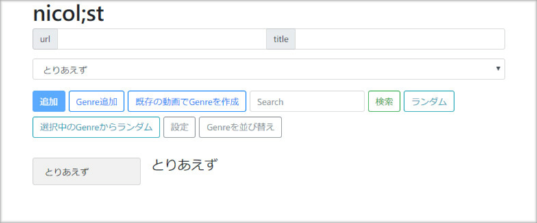
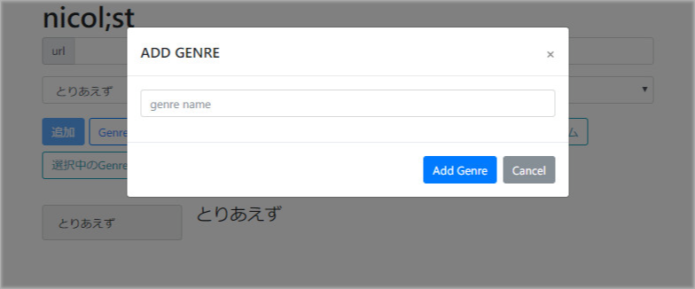
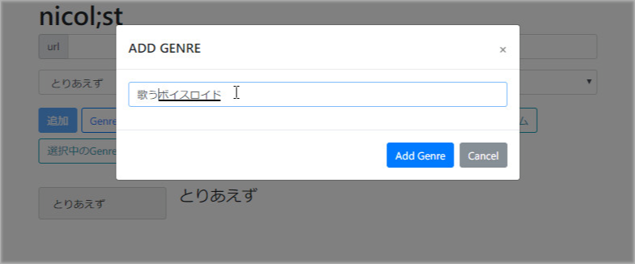
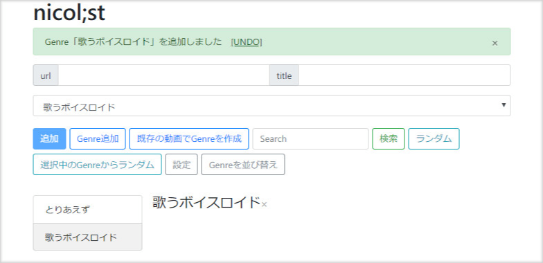
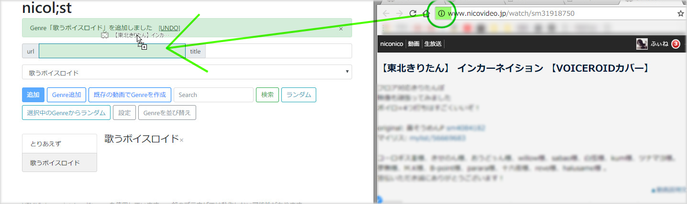
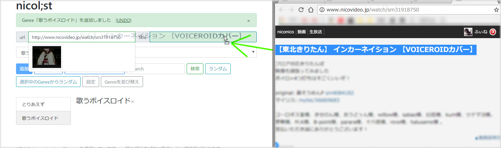
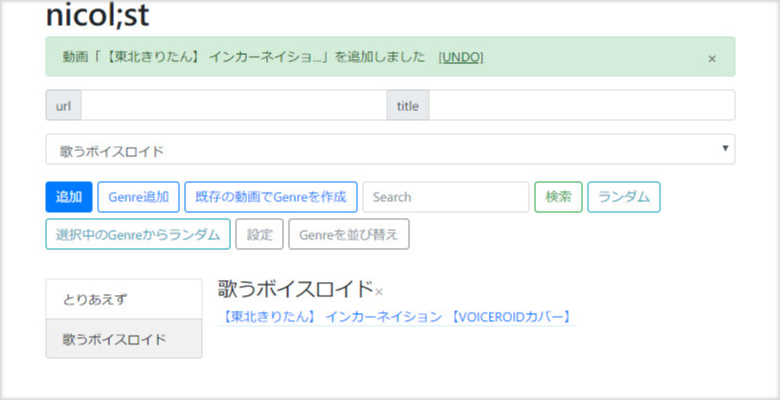

# nicol;st

### 概要
ニコニコ動画 / YouTube の動画タイトルをIDとともに保存して連続再生するJavascript。  
公式のマイリストではできないマイリスト内検索など、面白い機能や便利なツールを追加していきたい。

### デモページ
* [https://tkgwku.github.io/n/index.html](https://tkgwku.github.io/n/index.html)   
* [以前のページ](http://jar.oiran.org/app/nicolist/)   

Downloadし、index.htmlを開くのも可能だが、ページ内で動画を見ることができない

### 基本的な使い方
1. [nicolist](https://tkgwku.github.io/n/index.html)をGoogle Chromeなどで開く
2. 動画のリンクをコピーペースト、またはドラッグ&ドロップ(以降D&Dと略記)
3. 「追加」を押し保存

### Getting Started
  
最初はちょっと殺風景すぎて使いにくい。  
  
ジャンルを追加してみると見やすくなる。  
  
  
   
情報はD&Dで自動入力できる   
(実はリンクをD&Dするとタイトル情報などが自動入力される。)   
  
範囲選択したテキストをD&Dするとフォームに自動で入力される。   
  
追加完了  

### 現在の機能一覧
(一覧)
* ジャンル
* ジャンルの削除 (xマーク)
* お気に入り
* サムネの表示
* 【】や [] 内のワードをタグとして表示

(ページ上部ボタン)
* ニコニコ動画、Youtubeの動画を登録できる
* リンクをD&DするとURLだけでなくリンクのタイトル情報をフォームに自動入力
* ジャンルを並び替え
* 複数動画を選択してコピーまたは移動
* 複数動画を選択して新規ジャンルにコピーまたは移動
* 全動画から検索
* 無作為に動画を選ぶ
* 設定
* 同期に利用できるJSONデータを出力

(右クリックメニュー)
* ページ内で再生 
* ページ内で連続再生
* ランダム連続再生
* 動画情報を変更
* 動画をリストから削除

(連続再生)
* YouTube動画でも自動で次の動画に遷移
* 再生専用ページで再生
* ニコニコ動画プレイヤーの音量設定を動画ごとに保存
* プレイリストでループ再生
* 削除/非公開動画はスキップ

(その他)
* 基本操作のUNDOやREDO (UNDO=もとに戻す / REDO=もとに戻したのをやっぱりもう一回やる)

### 注意点
* Internet ExplorerではJavaScriptが読み込まれず使用できません。なぜなんですか...
* ブラウザのキャッシュやサーバーの応答の仕様上、バージョン更新直後は何らかの不具合が発生します。少し待ってからアクセスするか、キャッシュを削除してみてください。
* nicol;stはブラウザのローカルストレージにデータを保存しています。ローカルストレージは、CClearnerといったクリーナーソフトやブラウザの閲覧データ消去によって初期化してしまう場合があります。クリーナーソフトを使う前・閲覧データを削除する前に、バックアップを取るようにしてください。
* 一部の動画は投稿者の設定によって、他ウェブサイトでの視聴ができない場合があります。連続再生では再生できない動画はスキップされます。

### これから消えるかもしれない現仕様
* 再生専用ページのプレイリストの内容はURLに載せているのでブックマークに登録して保存できる

### 主な変更履歴
ver 1.0.0
・変更履歴があったほうが便利なので記録します。

### TODO
* 操作で行った変更内容をリストで表示
* 外部プレイヤーのUIを改善
* お気に入りを名前をつけて保存
* 動画を並び替え
* ジャンルの名前を変更
* Windows Explorerのようなリネーム・選択機能
* プレイリストの保存
* PythonライブラリのEELを活用し、デスクトップでホットキーを監視しながら連続再生
* 名前順で動画を並び替え
* 検索結果の数が多い場合折りたたむようにする
* 視聴履歴
* 最近追加した項目

### 追加しなさそうな機能 / 追加が難しい機能 
* クエリ
* 再生数情報などの取得

### 問題
* チャンネル動画はサムネイルが取得できない
